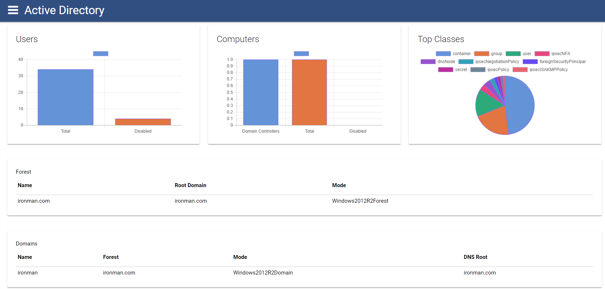
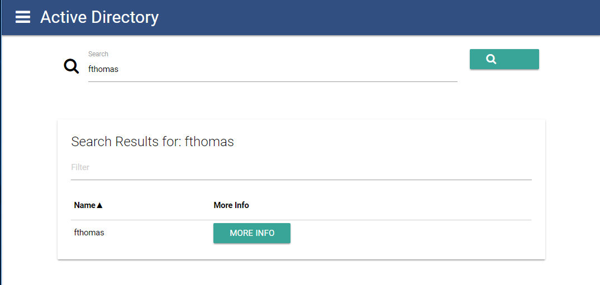
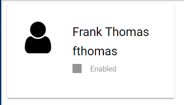
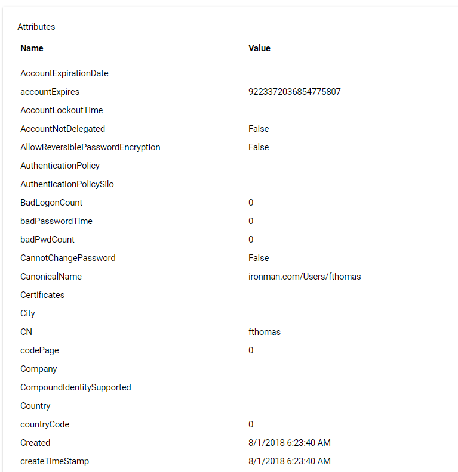
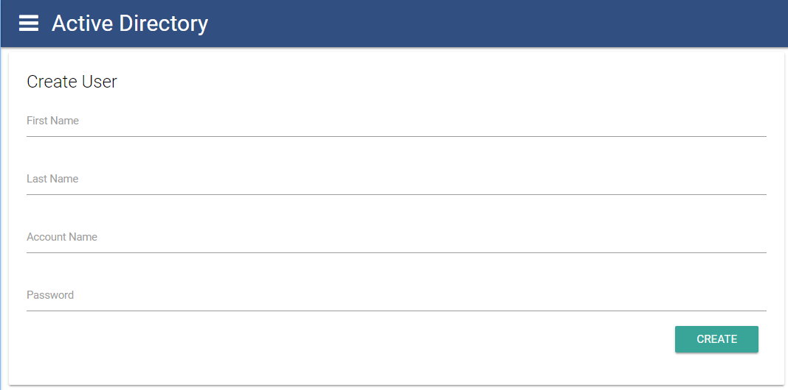
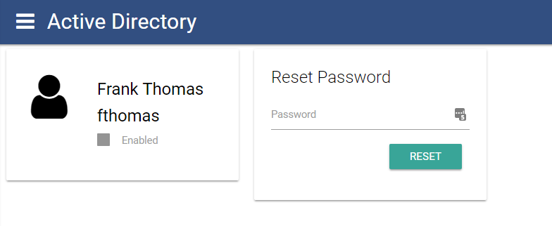
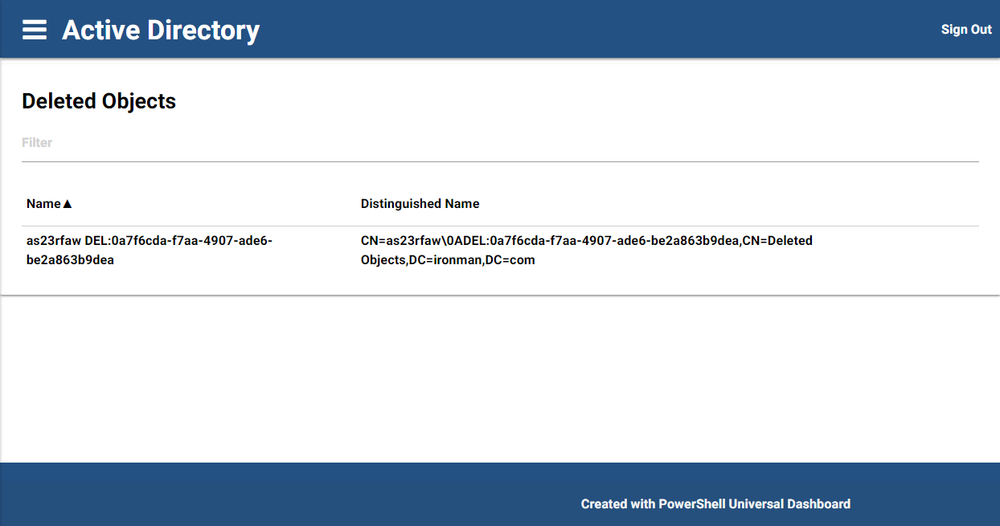

# ud-activedirectory

Active Directory Dashboard built on Universal Dashboard.

[Marketplace](https://marketplace.universaldashboard.io/Dashboard/ud-activedirectory) 

## Features 

- Overview of Active Directory Forest and Domains
- Search for Objects
- View All Attributes
- Reset User Passwords
- Create Users

## Usage

```
Import-Module ud-activedirectory 
Start-UDActiveDirectoryDashboard -Server myDomainController -Credential administrator
```

## Description 

This dashboard reads data from a domain and produces a dashboard that displays basic information about the domain on the home page. From there you can also search the domain, view objects and their attribute and create users. The dashboard features a login page and custom navigation.

## Home Page Dashboard



## Search for Objects



## Object Overview



## View All Attributes



## Create Users



## Reset Passwords



## Manage Group Membership


## Show Deleted Objects



_Icon from [Icons8](http://icons8.com)_
